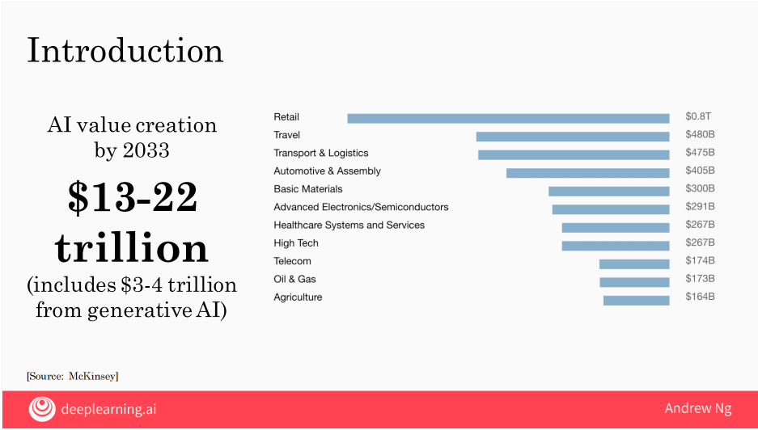
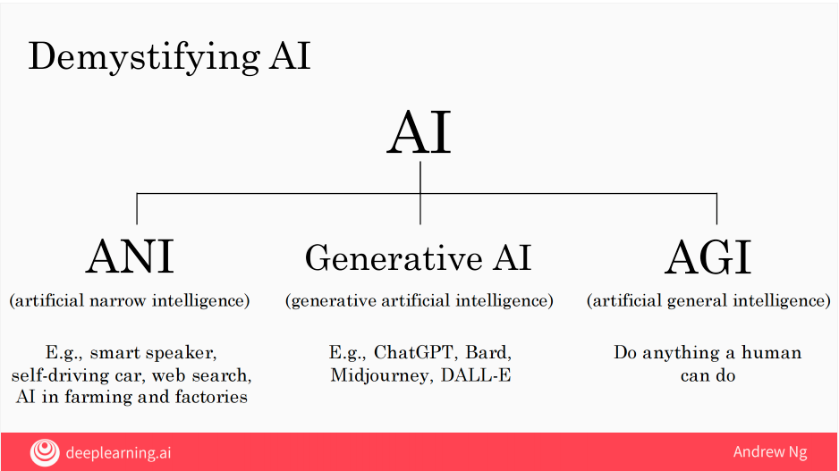
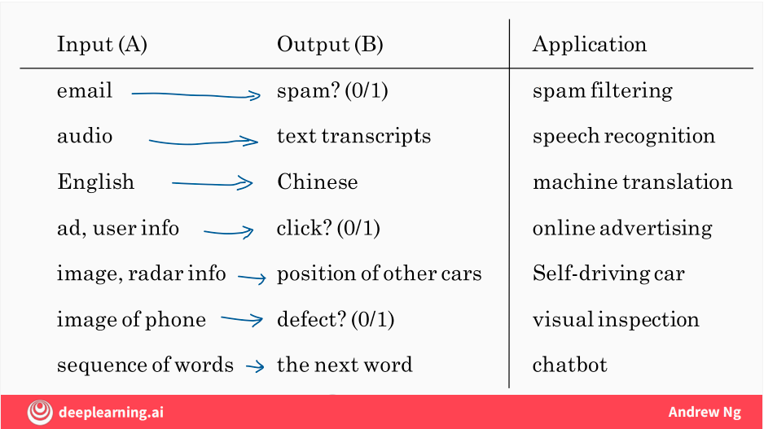
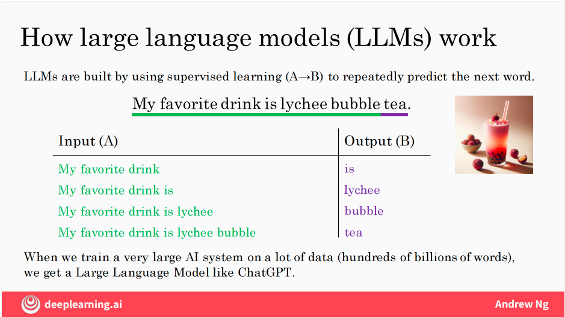
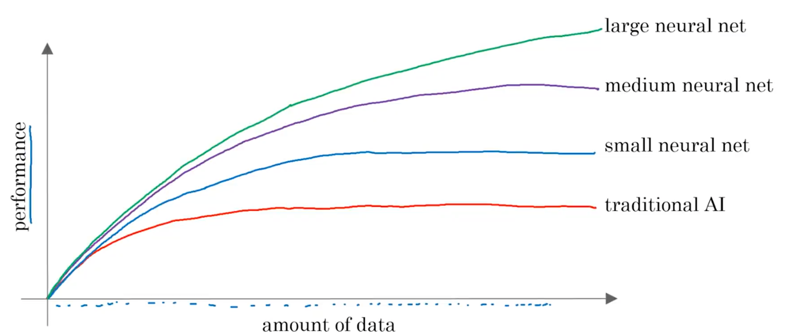
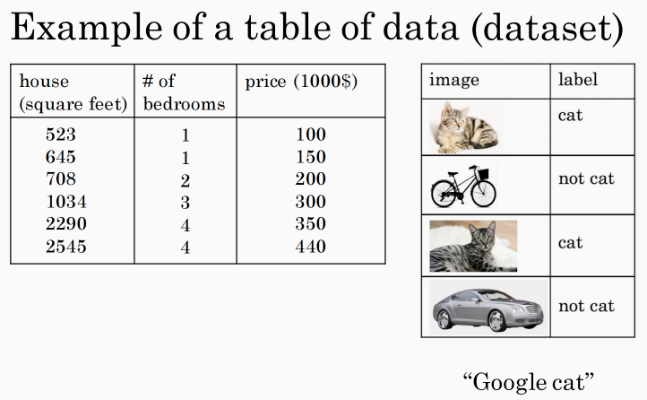
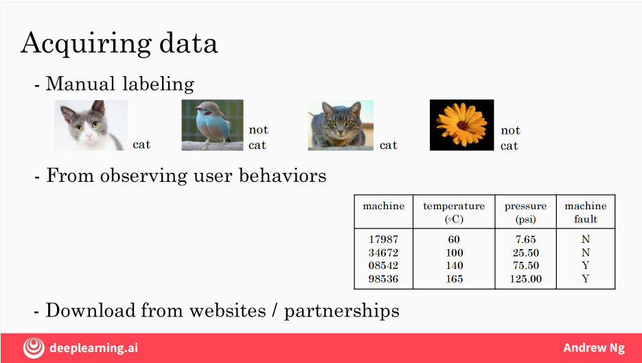
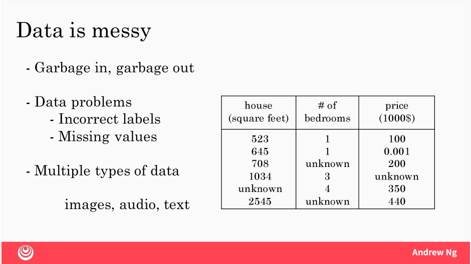
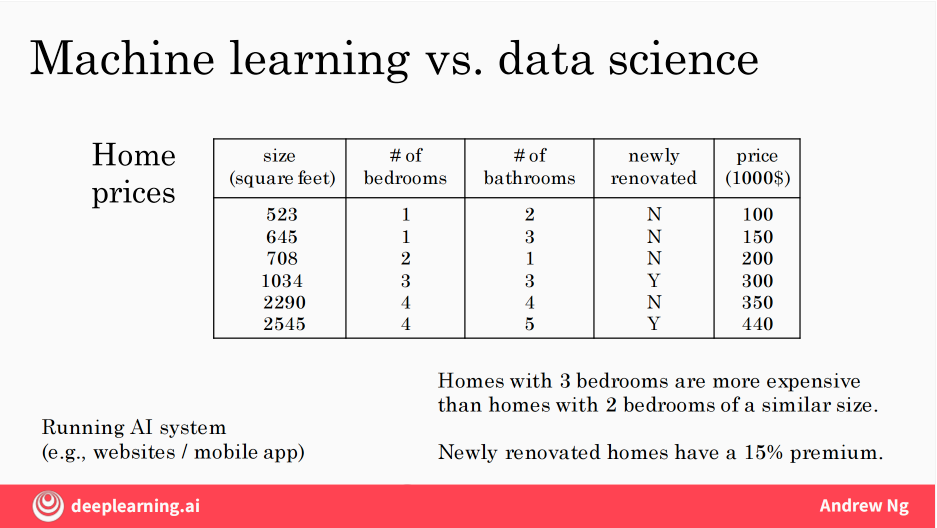

# AI For Everyone
本文总结于吴恩达视频课程 《ai for everyone》
refs: https://www.coursera.org/learn/ai-for-everyone/home/week/1

bilibili: https://www.bilibili.com/video/BV1yC4y127uj?vd_source=275f6919f1e622d67ac6c138d0967924&spm_id_from=333.788.player.switch&p=17

## 什么是人工智能？
AI 行业的兴起和价值：到 2030 年，据预测，人工智能每年将创造 13 万亿美元的价值

未来会有更多的价值在软件行业之外，例如零售、电商、旅游、自动化制造等行业。

AI 实际上可以细分为两个独立的概念：

- 弱人工智能 —— ANI （artificial narrow intelligence）E.g., smart speaker, self-driving car web search, AI in farming and factories
- 通用人工智能 —— AGI （artificial geneal intelligence）Do anything a human can do

### 机器学习(what is AI?)

#### 监督学习（supervised learning)
> 通过使用带有标签的的训练数据（从输入 A 到输入 B的映射关系）来训练模型。训练数据包括输入特征和对应的输出标签，模型通过学习这些数据来预测新输入的输出。

例如大模型 （LLMs）就是采用监督学习（A->B）来重复预测下一个词实现的（LLMs are build by using supervised learning(A->B) to repeatedly predict the next word.）

#### 监督学习的应用场景
- 垃圾邮件过滤：输入的是邮件的内容，输出是判断是否为垃圾邮件（0/1）
- 语音识别：输入的是音频片段，输出的是文字转录
- 机器翻译：输入的是一种语言（英语），输出的是另外一种语言（如中文）
- 在线广告：输入的是广告信息和用户信息，输出的是用户是否会点击广告
- 自动驾驶：输入的是图像和雷达数据，输出的是其他车辆的位置。
- 制造业视觉检测：输入的是产品图片，输出是判断是否存在缺陷（如凹痕和损伤）

- 生成式 AI （Chatgpt）：输入的是文本片段，输出的是预测下一个词，通过大量的文本数据训练生成新内容

#### 监督学习为何近年来快速发展？
- 信息爆炸时代，数据的增长：互联网和计算机的普及使得可用的数据量大幅度上升。
- 神经网络和深度学习研究的崛起。
- 算力的提升：GPU 等智能硬件

#### 高性能 AI 系统的关键因素
- 大量的训练数据：通常情况下，数据越多，模型的性能通常越好
- 大规模神经网络：更大的模型能够更好地捕捉复杂模式
- 算力： GPU 高性能显卡的出现

#### 监督学习的核心价值
尽管监督学习看似简单（只是构造 A->B 的映射关系）,但是在合适的应用场景中，它能够创造巨大的经济和技术价值。
例如，语音识别、在线广告和自动驾驶等领域的高性能 AI 系统都依赖于监督学习

## 什么是数据（What is data?）
这里有两类数据集：
房屋数据&&猫咪图片数据
数据的定义和类型：
- 数据是 AI 系统的核心燃料，通常以表格（Excel）或非结构化的形式（图片/音频）存在

### 数据获取的方式（how to acquire data）
- 手工标注（Manual labeling）
- 用户行为画像
  - 用户行为（如电商记录用户价格敏感度和购买决策）
  - 机器行为数据（如工厂设备温度、压力来判断是否故障）
- 开源数据/合作伙伴（如工厂提供设备历史数据）

### 有用或者无用的数据（Use and mis-use of data）
不要本末倒置的使用数据（Don't throw data at an AI team and assume it will be valuable.）

### 数据的常见误区

- 过度投资 IT 基础设施
  - 错误：先花多年时间完善数据，再启动 AI.
  - 正确：**边收集数据边迭代**，AI 团队需早期介入以优化数据搜集策略。
- 
- 盲目搜集数据
  - **数据量 != 价值，需要结合 AI 团队验证数据有效性**
  - 反例: 某公司收购了医疗数据却无法提取价值

- 考虑数据的质量
  - 错误的数据/无用的数据/标记错误的数据/缺失的数据

### 数据处理的挑战

- 数据清洗：处理错误值（如房价标记为 $0.001）、缺失值（如未知卧室数）
- 数据类型差异：
  - **结构化数据（表格）与非结构化数据（图像、音频）需不同技术处理。**
  - 监督学习适用于两者，但生成式 AI 更擅长处理非结构化数据。

### 关键建议

- 尽早与AI 团队合作：优化数据搜集的方向，结合不同的数据需求来定制化搜集数据。
- 避免数据崇拜：数据需要和业务目标结合，而非单纯追求规模
- 接受数据复杂性：数据天然混乱，需要通过清洗和预处理提升质量

## 人工智能术语（The terminology of AI）

### 人工智能 vs. 数据科学
什么是机器学习？

#### 机器学习
> - 定义：**机器学习是让电脑在不被编程的情况下，就可以自己学习的研究领域。（machine learning is the field of study
> that gives computers the ability to learn without being explicitly programmed.）**
> - 应用：实时运行的 AI 系统（如广告点击率预测、自动驾驶）
> - 核心目标：生成可自动执行任务的软件（如 24/7 服务的推荐系统。

#### 数据科学
> 数据科学
> - 定义：通过挖掘数据来获取见解(Science of extracting knowledge and insights form data.)
> - 输出：商业决策支持（如幻灯片报告、产品优化建议）
> - 应用案例：发现“三卧室房屋溢价”或“翻新房屋增值 15%” 等规律

